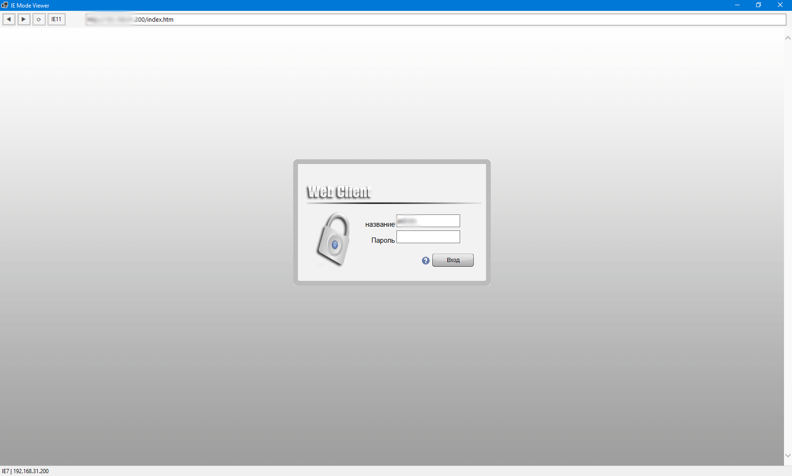
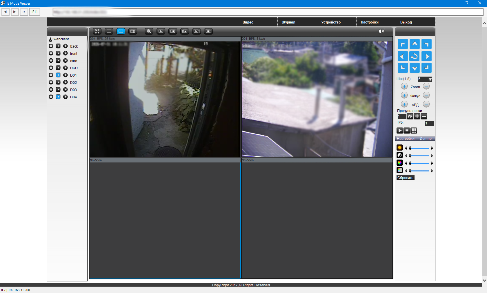
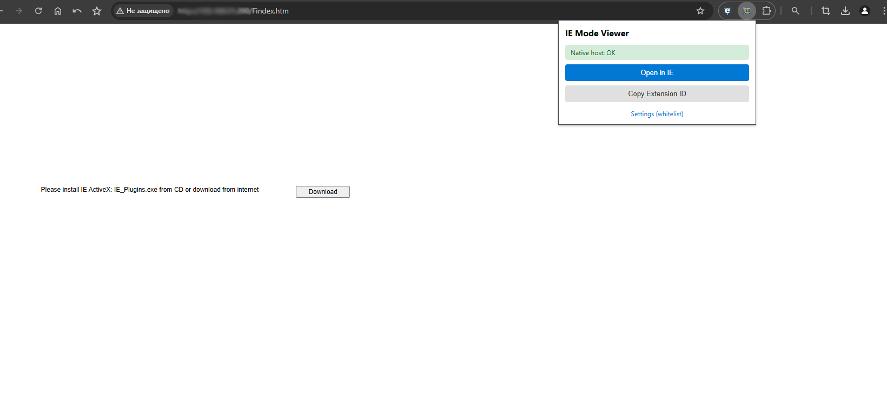

<div align="center">

[English](README.md) · [Русский](README_RU.md)

# IE Mode Viewer

**Открывайте старые страницы в настоящем окне Internet Explorer (Trident) прямо из Chrome/Edge — ActiveX, DVR и корпоративные контролы просто работают.** Работает с расширением или без него (автономный режим с иконкой в трее).

[Скриншоты](#скриншоты) · [Возможности](#возможности) · [Архитектура](#архитектура) · [Установка](#установка) · [План развития](#план-развития)

[](LICENSE)
[]()
[]()
[]()

</div>


## Почему этот проект?

> Режим IE больше не поддерживает наше окружение, поэтому я написал собственную замену.

Некоторые старые веб-приложения — системы видеонаблюдения (DVR), корпоративные порталы, промышленное ПО — всё ещё требуют контролов ActiveX, которые работают только в Internet Explorer. Это расширение открывает такие страницы в отдельном окне IE (Trident) из Chrome/Edge в один клик.

> **Предупреждение о безопасности.** Просмотрщик включает ActiveX и добавляет каждый открытый хост в зону «Надежные сайты» IE (для пользователя, HKCU). Также ослабляются проверки SSL, DEP и загрузки файлов для процесса просмотрщика. Используйте его **только для доверенных легаси-страниц** — DVR, корпоративные порталы, интранет — и **никогда** не заходите в нём на неизвестные публичные сайты. На легаси-страницах может выполняться произвольный ActiveX/скриптинг с ослабленной защитой.

## Скриншоты

| | |
|---|---|
|  |  |
|  |  |

## Возможности

- **Открытие в один клик** — текущая вкладка отправляется в IE-просмотрщик из попапа на панели инструментов.
- **Автооткрытие по белому списку** — glob-шаблоны на странице настроек; подходящие URL открываются в IE автоматически.
- **Native Messaging** — Chrome общается с .NET-хостом по JSON-протоколу stdin/stdout.
- **Переключение эмуляции IE7–IE11** — кнопка на панели циклически меняет режим документа, без правки реестра.
- **ActiveX включён** — установка разрешена, фильтрация выключена, обход DEP, безопасный скриптинг контролов.
- **Автодобавление в надежные сайты** — хост страницы попадает в зону «Надежные сайты» IE.
- **Обход страниц ошибок SSL** — устаревшие сертификаты больше не блокируют страницу.
- **Установка для пользователя** — только HKCU, права администратора не нужны, регистрация для Chrome и Edge.
- **Автономный режим** — запустите `IEHost.exe` без расширения: иконка в трее + глобальная горячая клавиша (`Ctrl+Alt+E`) открывает активную вкладку Chrome в IE-просмотрщике.

## Архитектура

```
┌──────────────┐   ┌─────────────────────┐   ┌────────────────────────────────────┐
│  Попап /     │   │  Service worker     │   │  IEHost.exe  (.NET 11, win-x86)    │
│  настройки / │──▶│  background.js      │──▶│  Native Messaging loop (stdio JSON) │
│  content     │   │  sendNativeMessage  │   │    └─ spawn --viewer <url>         │
│  script      │   └─────────────────────┘   │  ViewerForm (WinForms)             │
└──────────────┘                              │    └─ WebBrowser (Trident)         │
                                              │  HKCU reg tweaks (IE / ActiveX)    │
                                              └────────────────────────────────────┘
```

- Обмен Chrome ↔ хост идёт по протоколу **Native Messaging**: 4-байтная длина (little-endian) + UTF-8 JSON в stdin/stdout.
- **Автономный режим**: `IEHost.exe` запускает приложение в трее с глобальной горячей клавишей. Chrome находится через реестр (App Paths, запасной вариант — Edge), запускается управляемый Chrome с `--remote-debugging-port` и отдельным профилем (`%LOCALAPPDATA%\IEHost\ChromeProfile`), затем активная вкладка читается через Chrome DevTools Protocol. При первом запуске запрашивается URL по умолчанию; просмотрщик всегда открывает последний посещённый URL (`lastUrl`).
- Просмотрщик запускается как **отдельный 32-битный процесс (`win-x86`)** — старые DVR-контролы ActiveX это 32-битные COM-компоненты и не загружаются в 64-битный процесс.
- Настройки IE и ActiveX применяются **для пользователя (HKCU)** при старте просмотрщика — права администратора не нужны.
- ID расширения **динамический в процессе разработки**; `install.ps1` перезаписывает манифест хоста и ключи реестра при каждом запуске.

## Технологии

| Слой | Технология |
|---|---|
| Расширение | Chrome/Edge Manifest V3, чистый JS (без сборки) |
| Нативный хост | C# / .NET 11 (`net11.0-windows`) |
| Интерфейс | Windows Forms + контрол `WebBrowser` (движок Trident) |
| IPC | Native Messaging (JSON через stdio) |

## Как это работает

1. Клик по иконке расширения — попап проверяет, установлен ли нативный хост.
2. Клик по кнопке **Открыть в IE** — попап отправляет URL активной вкладки в service worker.
3. `background.js` вызывает `chrome.runtime.sendNativeMessage` → `IEHost.exe`.
4. `IEHost.exe` читает JSON-запрос и запускает себя с `--viewer <url>`.
5. Процесс просмотрщика применяет правки HKCU: эмуляция IE11, поддержка ActiveX, надежные сайты, обход SSL.
6. Открывается окно WinForms с контролом `WebBrowser` (Trident), которое переходит на URL.
7. Для URL из белого списка тот же сценарий запускается автоматически через content script.

### Автономный режим (без расширения)

1. Запустите `IEHost.exe --standalone` (или ярлык на рабочем столе, созданный `install.ps1 -Standalone`).
2. При первом запуске диалог запросит URL по умолчанию; появятся иконка в трее и глобальная горячая клавиша `Ctrl+Alt+E`.
3. При открытом Chrome нажмите горячую клавишу — URL активной вкладки читается через CDP и открывается в IE-просмотрщике.
4. Просмотрщик всегда переоткрывает последний посещённый URL (`lastUrl`) — правый клик по иконке в трее меняет горячую клавишу или выходит из приложения.
5. `install.ps1 -Standalone -Autostart` добавляет приложение в автозагрузку Windows (HKCU Run).

### Быстрый старт (для не-технических пользователей)

1. Скачайте **IEHost.exe** — один автономный файл, больше ничего не нужно.
2. Запустите его, прочитайте **предупреждение про ActiveX / доверенные зоны** и подтвердите установку (создаётся ярлык на рабочем столе).
3. При первом запуске введите адрес вашего DVR / портала — страница откроется в IE-просмотрщике.
4. Дальше просто открывайте ярлык **IE Mode Viewer** на рабочем столе.

Установка происходит и при двойном клике по файлу из любой папки (Downloads и т.д.) — сначала появится запрос на установку.

## Установка

Требуются **Windows 10/11**. **.NET 11 SDK** нужен только при сборке хоста из исходников — конечным пользователям достаточно готового `IEHost.exe` (см. [требования](#требования)).

```bash
git clone https://github.com/DVR-Claw-Aist/Chrome-extension-IE-Mode-Viewer.git
cd Chrome-extension-IE-Mode-Viewer
dotnet publish -c Release -r win-x86 --self-contained native\IEHost\IEHost.csproj
.\install.ps1 -ExtensionId <ID>
```

Загрузите расширение на `chrome://extensions` → включите **Режим разработчика** → перетащите `extension.crx` на страницу или нажмите **Загрузить распакованное** и выберите папку `extension/`. ID расширения показан в попапе или на `chrome://extensions`.

> **ID расширения динамический в процессе разработки.** Native messaging нужно перерегистрировать при каждом изменении ID: `.\install.ps1 -ExtensionId <ID>`. Чтобы закрепить ID навсегда, упакуйте расширение с приватным ключом (Chrome → **Pack extension**) и храните `extension.pem` **только локально** — он исключён из этого репозитория.

### Требования

- Windows 10 или 11
- .NET 11 SDK — только для сборки хоста: системная установка в `PATH` или `.\install.ps1 -DotNetPath <путь\к\dotnet.exe>`
- Chrome или Edge 88+

.NET SDK **не включён** в репозиторий и нужен только для сборки хоста (публикация self-contained — конечным пользователям .NET не требуется). Установите его со [страницы .NET 11.0 SDK](https://dotnet.microsoft.com/en-us/download/dotnet/11.0).

### Команды

| Команда | Описание |
|---|---|
| `dotnet publish -c Release -r win-x86 --self-contained native\IEHost\IEHost.csproj` | Сборка автономного 32-битного нативного хоста |
| `.\install.ps1 -ExtensionId <ID>` | Установка хоста + регистрация для Chrome и Edge (HKCU, без админа) |
| `.\install.ps1 -Standalone` | Создать ярлык на рабочем столе для автономного режима |
| `.\install.ps1 -Standalone -Autostart` | Также добавить приложение в автозагрузку (HKCU Run) |
| `.\install.ps1 -DotNetPath <путь>` | Установка с указанием пути к .NET SDK |

## План развития

- [ ] Автоматические тесты (JS + нативный хост)
- [ ] Установщик (MSI) с определением пути SDK
- [ ] Пункт контекстного меню «Открыть в IE»
- [ ] Запоминание режима эмуляции для каждого сайта
- [ ] 64-битный запасной хост для страниц без ActiveX

## Лицензия

Распространяется под лицензией [MIT](LICENSE).
